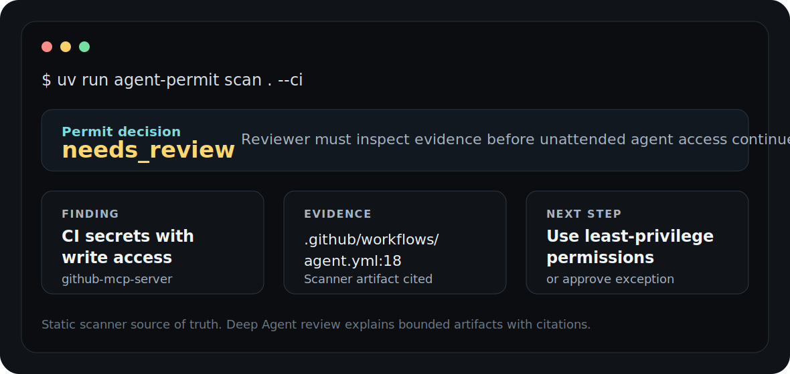

# PermitGraph

[](https://github.com/IntelIP/agent-permit-office/actions/workflows/ci.yml)
[](https://github.com/IntelIP/agent-permit-office/actions/workflows/agent-permit.yml)
[](LICENSE)
[](pyproject.toml)

Pre-flight security checks for AI coding agents.

PermitGraph scans a repository before agents receive tools, secrets, memory, MCP servers, or CI write access. It returns a clear permit decision: `approved`, `needs_review`, or `blocked`, with evidence a reviewer can inspect.

Run it before enabling Codex, Claude, Cursor, GitHub Actions agents, LangGraph/LangChain agents, or MCP tools inside sensitive repositories.



## Why This Exists

AI teams are wiring coding agents, MCP servers, CI workflows, repo instructions, and long-lived credentials into the same repos. Normal code review does not show whether an agent can reach a secret, write to a protected branch, follow unsafe repository instructions, or pass repo context into an external tool.

PermitGraph turns those agent-access facts into reviewable evidence before the agent runs.

## 60-Second Scan

Install dependencies:

```bash
uv sync --all-extras --dev
```

Scan a repository:

```bash
uv run agent-permit scan . --ci --exclude "tests/fixtures/**"
```

Open the generated evidence:

```text
.agent-permit/runs/<run_id>/summary.md
.agent-permit/runs/<run_id>/permit.yaml
.agent-permit/runs/<run_id>/raw-findings.json
.agent-permit/runs/<run_id>/graph-paths.json
```

The scanner is static. It does not execute agent code, MCP servers, CI workflows, package scripts, or external tools.

## What A Finding Looks Like

Plain-English result:

```text
Status: needs_review

Review CI secrets and write permissions in github-mcp-server.

Why: a workflow references CI secrets and also has write permissions.
Reviewer question: should this automation be allowed before agent access continues?
Evidence: .github/workflows/agent.yml:18
Next step: use least-privilege workflow permissions or document an exception.
```

Machine-readable artifacts preserve the same evidence for CI, dashboards, proof packs, SARIF, and AI review.

## What It Checks

- MCP server configuration and tool boundaries
- CI workflow permissions and secret references
- repository instructions for AI tools
- credential-bearing environment references
- generated agent artifacts
- source-to-sink paths in the Agent Capability Graph
- policy controls before access approval

## How It Fits With Other Tools

| Tool | Main job | PermitGraph job |
| --- | --- | --- |
| Trivy | Find vulnerabilities, misconfigurations, secrets, and SBOM issues. | Decide whether AI agents should receive repo/tool/credential access. |
| Semgrep | Find code and security patterns across source files. | Connect repo instructions, MCP config, CI permissions, and credentials into agent-access findings. |
| OPA | Enforce general policy as code. | Provide a domain-specific scanner and artifacts for AI agent access review. |
| LangSmith | Observe, evaluate, and debug agents after or during execution. | Gate access before the agent receives dangerous capabilities. |

PermitGraph is not a replacement for SAST, dependency scanning, secrets scanning, or LLM observability. It is the missing review gate for agent permissions.

## Deep Agent Review

Deep Agent review is part of the product path, not a side demo.

The deterministic scanner creates bounded evidence. The Deep Agent reads that evidence, reasons across related artifacts, writes a cited report, and the citation critic checks whether claims are grounded.

Run from an existing scan:

```bash
export OPENROUTER_API_KEY=<key>
uv run --extra deep-agent agent-permit investigate .agent-permit/runs/<run_id>
```

Offline deterministic fallback for tests or no-key debugging:

```bash
uv run agent-permit investigate .agent-permit/runs/<run_id> --deterministic-only
```

Default live-model path uses Claude Sonnet through OpenRouter. Prompt caching, response caching, timeout caps, completion caps, token metrics, and cache-hit metrics are recorded in local run artifacts.

## GitHub Action

Use PermitGraph in pull requests before risky agent-access changes merge:

```yaml
name: PermitGraph

on:
  pull_request:

permissions:
  contents: read
  security-events: write

jobs:
  scan:
    runs-on: ubuntu-latest
    steps:
      - uses: actions/checkout@v6
        with:
          persist-credentials: false
      - uses: IntelIP/agent-permit-office@main
        with:
          path: .
          exclude: |
            tests/fixtures/**
          sarif: "true"
          upload-sarif: "true"
```

## Proof Packs

Generate dashboard data and a shareable proof pack:

```bash
python3 tools/export_dashboard_snapshot.py
python3 tools/export_dashboard_snapshot.py --proof-pack
```

The proof pack exporter prints both paths:

```text
.agent-permit/proof-packs/<validation_run_id>
.agent-permit/proof-packs/<validation_run_id>.zip
```

Proof packs are redacted, but still sensitive. Review them before sharing.

## Local Apps

Run the local dashboard:

```bash
cd dashboard
bun install
bun dev
```

Run the documentation site:

```bash
cd docs-site
bun install
bun dev
```

Then open `http://localhost:3000/docs` or the next free port printed by Next.js.

## Common Commands

```bash
uv run agent-permit rules
uv run agent-permit scan . --ci --sarif
uv run agent-permit sarif .agent-permit/runs/<run_id>
uv run agent-permit baseline .agent-permit/runs/<run_id> --output .agent-permit/finding-baseline.json
uv run agent-permit scan . --ci --baseline .agent-permit/finding-baseline.json --ci-new-findings-only
uv run agent-permit scan . --ci --policy agent-permit-policy.json
uv run agent-permit analytics summarize .
uv run agent-permit eval tests/fixtures
uv run --extra phoenix agent-permit eval tests/fixtures --upload-phoenix
```

## Open-Core Boundary

Open-source core:

- deterministic scanner and rule registry
- Agent Capability Graph builder and risky path finder
- permit engine and local artifact schemas
- Markdown, JSON, YAML, SARIF, baseline, diff, policy, metrics, and eval outputs
- bounded Deep Agent evidence tools, prompt flow, and citation critic
- OpenRouter adapter with local cost/cache telemetry
- Phoenix local tracing and eval export support
- GitHub Action and local dashboard snapshot workflow

Hosted product roadmap:

- multi-repo queue and team review workflow
- private repo connectors and scheduled scans
- SSO/RBAC, assignments, approval history, and audit retention
- managed model gateway, model policy, key isolation, and spend controls
- policy packs, custom rules, notifications, support, and SLA

The hosted product is not required to use the local scanner. Commercial value is managed workflow, governance, retention, and integrations, not hiding scanner logic.

## Safety Boundaries

- Static scanning only: no agent, MCP server, CI workflow, package script, or external tool execution during scans.
- Real `.env` files and generated/junk directories are skipped.
- Secret values are not emitted; evidence may include secret variable names when needed for risk explanation.
- Proof packs copy only allowlisted artifacts and apply redaction before export.
- Deep Agent output explains scanner artifacts. It does not replace scanner evidence.

## Documentation

Developer docs:

- `docs-site/` - curated Fumadocs site for developers and AI agents
- `AGENTS.md` - repo guidance for AI agents
- `llms.txt` - compact AI-readable docs map
- [AI Analysis Guide](docs/ai-analysis-guide.md)
- [Artifact Reference](docs/artifact-reference.md)

Planning and research archives live in [docs/](docs/).

## Contributing

Good first contribution areas:

- deterministic rule improvements
- false-positive reductions
- fixture coverage
- SARIF output improvements
- GitHub Action hardening
- documentation and demo clarity

Read [CONTRIBUTING.md](CONTRIBUTING.md), [SECURITY.md](SECURITY.md), and [SUPPORT.md](SUPPORT.md) before opening issues or pull requests. Do not paste secrets, private code, raw traces, or customer data into public issues.

## Verification

Run the public-release check:

```bash
python3 tools/release_check.py
```

Core checks:

```bash
uv run pytest -q
cd docs-site && bun run build
```
