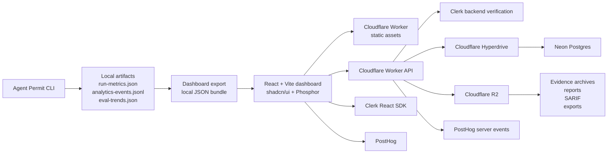

# Agent Permit Office Dashboard Stack Architecture

Date: 2026-06-08

## Decision

Sprint 31 standardizes the dashboard and future hosted control plane around this stack:

| Layer | Standard | Responsibility |
| --- | --- | --- |
| Runtime and package manager | Bun | local dashboard dev, build scripts, dependency management |
| UI primitives | shadcn/ui | accessible component source, dashboard composition, theme tokens |
| Icons | Phosphor Icons | product-specific security, audit, repo, and eval icon language |
| Palette process | Coolors | standalone Agent Permit Office palette selection before coding |
| Frontend app | React + Vite | dashboard SPA and local product surface |
| Compute and hosting | Cloudflare Workers | API routes, static assets, edge auth/session handling, dashboard delivery |
| Database | Neon Postgres | orgs, repos, scan runs, findings, approvals, policies, model usage |
| Database acceleration | Cloudflare Hyperdrive | pooled Worker-to-Neon Postgres access |
| Auth | Clerk | users, organizations, sessions, frontend auth state, backend token verification |
| Blob storage | Cloudflare R2 | uploaded scan bundles, reports, SARIF, dashboard exports, evidence archives |
| Product analytics | PostHog | product events, funnels, retention, feature flags, session replay later |

The current OSS CLI remains local-first. Hosted pieces are an open-core path, not Sprint 31 implementation scope.

## Source Notes

- Stack Picker frames stack selection as layer choices and prompt/diagram export, but full tool access is gated. We use it as a checklist, not as a dependency.
- Cloudflare Workers now support static assets and framework guides for React + Vite.
- Cloudflare recommends Hyperdrive for Neon from Workers when using Postgres drivers because Hyperdrive handles pooled, lower-latency database access across Cloudflare's network.
- Cloudflare bindings give Workers direct capabilities such as R2, Hyperdrive, secrets, assets, and services.
- Clerk React gives frontend auth components/hooks, and Clerk session tokens can authenticate backend requests.
- PostHog React supports product analytics, custom event capture, session recording, feature flags, and provider/hook-based access.

## Architecture



## How Pieces Connect

### Local OSS Mode

```text
agent-permit scan/live-validate/eval
  -> .agent-permit/runs/*/run-metrics.json
  -> .agent-permit/analytics-events.jsonl
  -> .agent-permit/eval-trends/*/eval-trends.json
  -> dashboard data export
  -> static dashboard
```

No Clerk. No Neon. No R2. No PostHog. No remote calls by default.

### Hosted Open-Core Mode

```text
browser dashboard
  -> Clerk session
  -> Cloudflare Worker API
  -> Clerk verifies request
  -> Neon stores relational state
  -> R2 stores evidence/report blobs
  -> PostHog receives product events
```

Hosted mode adds org/repo history, approvals, policy workflow, retention, and product analytics.

## Component Responsibilities

### shadcn/ui

Use shadcn as source-code component layer:

- `Sidebar` for product navigation
- `Card` only for individual panels, not nested page wrappers
- `Table` for runs, rules, findings, approvals
- `Badge` for permit/severity states
- `Tabs` for overview, runs, rules, evals, events
- `Sheet` for run detail drawer
- `Chart`/Recharts for severity, permit, eval, and cost trends
- `Tooltip` for hashes, counts, and citations

Gotcha: shadcn is not a hosted library. Components live in repo. Need enforce component hygiene, semantic colors, and no raw color drift.

### Phosphor Icons

Use Phosphor as visual identity layer:

- `ShieldCheck`, `WarningDiamond`, `LockKey`, `Database`, `Cloud`, `ChartLine`, `GitBranch`, `Robot`, `FileSearch`
- consistent weight: `regular` by default, `duotone` only for larger state or empty-state icons
- size scale: `16px` for nav/table/badges, `18px` for controls, `20px` for section headers/metrics
- color defaults to `currentColor` and follows semantic text/status tokens
- no mixed Lucide/Phosphor unless unavoidable

Gotcha: shadcn examples often use Lucide. Replace with Phosphor during implementation.

### Coolors Palette

Use Coolors before coding:

- one cool-neutral background family
- one muted primary signal color
- low-saturation semantic colors for approved, review, blocked, critical, agent trace, artifact/data, and muted/resolved
- accessible contrast checked in UI
- implementation tokens live in `docs/dashboard-visual-system.md`

Gotcha: do not let color become generic dark-blue security SaaS. Dashboard needs its own Agent Permit Office identity.

### Bun

Use Bun for dashboard package lifecycle:

```text
bun install
bun run dev
bun run build
bun run test
```

Gotcha: Python CLI still uses `uv`. Bun belongs to dashboard app only.

### Cloudflare Workers

Workers own:

- static dashboard asset serving
- API routes
- auth gate
- org/repo/run CRUD
- upload/download signed flows
- webhook ingestion later

Gotchas:

- use bindings instead of Cloudflare REST calls from Worker code
- use `ctx.waitUntil()` for post-response jobs
- avoid request-scoped mutable global state
- use `nodejs_compat` when required by database drivers
- enable structured observability in Worker config when hosted mode starts

### Neon Postgres

Neon owns relational truth:

- organizations
- users and Clerk identity mapping
- repositories
- scan runs
- findings
- controls
- permits
- approvals
- suppressions
- policy profiles
- model usage
- eval runs

Gotchas:

- use pooled/Hyperdrive access from Workers
- keep R2 blobs out of Postgres; store object keys and hashes
- use branch-based migration flow for preview/staging
- design for tenant isolation from day one

### Clerk

Clerk owns:

- user auth
- organizations
- sessions
- frontend auth state
- backend request authentication

Gotchas:

- do not trust frontend org/user IDs without backend verification
- sync only minimal Clerk identity fields into Neon
- use org ID as tenant boundary
- handle unauthenticated local OSS dashboard separately from hosted dashboard

### Cloudflare R2

R2 owns large and durable artifacts:

- compressed scan bundles
- raw reports
- SARIF exports
- screenshots
- dashboard exports
- future evidence archives

Gotchas:

- R2 is object storage, not query engine
- store metadata in Neon
- never store raw secrets; keep current redaction guarantees
- use signed upload/download patterns later

### PostHog

PostHog owns product analytics:

- activation funnel
- first scan
- first blocked permit
- first investigation
- first approval/suppression
- dashboard viewed
- repo connected
- eval trend viewed
- feature flag rollout

Gotchas:

- OSS local mode must not phone home by default
- hosted mode should identify users/orgs only after Clerk auth
- keep security payloads out of PostHog; send counts, statuses, and IDs/hashes only
- feature flags must fail safe

## Data Model Draft

```text
organizations
  id
  clerk_org_id
  name

users
  id
  clerk_user_id
  email_hash

repositories
  id
  organization_id
  provider
  name
  default_branch

scan_runs
  id
  repository_id
  run_id
  target_hash
  permit_status
  findings_count
  graph_paths_count
  controls_count
  started_at
  completed_at

findings
  id
  scan_run_id
  rule_id
  severity
  category
  path_hash
  line_start
  status

artifact_objects
  id
  scan_run_id
  r2_key
  sha256
  content_type
  byte_size

model_usage
  id
  scan_run_id
  model
  model_calls
  input_tokens
  total_tokens
  cached_tokens
  cache_hit_ratio

eval_runs
  id
  organization_id
  run_id
  pass_rate
  citation_failures
  aggregate_mismatches
```

## API Draft

```text
GET  /api/me
GET  /api/orgs/current
GET  /api/repos
POST /api/repos
GET  /api/repos/:repoId/runs
GET  /api/runs/:runId
GET  /api/runs/:runId/findings
GET  /api/runs/:runId/artifacts
POST /api/runs/:runId/suppressions
POST /api/runs/:runId/approvals
POST /api/uploads/presign
POST /api/ingest/scan-run
GET  /api/analytics/summary
```

## Dashboard Build Plan

### Sprint 31

- create stack decision and architecture doc
- define dashboard data contract
- define visual reference direction
- choose Coolors palette
- map shadcn components and Phosphor icons

### Sprint 32

- scaffold dashboard app with Bun, React, Vite, Tailwind, shadcn/ui
- add Phosphor icons
- render from local exported JSON
- defer Recharts/shadcn chart primitives until queue and detail rail are usable
- no hosted services yet

### Sprint 33

- add Cloudflare Worker shell
- serve dashboard static assets
- add API route stubs
- add local R2/Neon/Clerk config placeholders without deploying

### Sprint 34

- implement hosted persistence path behind explicit remote/deploy scope
- Neon schema and migrations
- Clerk auth verification
- R2 artifact storage
- PostHog capture

## Tradeoffs

| Decision | Upside | Tradeoff |
| --- | --- | --- |
| Cloudflare Workers over traditional server | edge-native, cheap, fast, fits open-core control plane | Worker runtime constraints; some Node libraries need compatibility flags |
| Neon over D1 | full Postgres, branching, richer relational model | needs Hyperdrive/pooling discipline from Workers |
| R2 for artifacts | cheap object storage, good Cloudflare fit | metadata must live elsewhere |
| Clerk over custom auth | fast org/session setup | vendor dependency; must verify backend requests correctly |
| PostHog over custom product analytics | funnels, flags, retention, session replay | local OSS must stay opt-in/no telemetry |
| shadcn over custom component kit | source-owned components, design-system foundation | component ownership moves into repo |
| Bun dashboard tooling | fast JS workflow | Python CLI still separate |

## Open Questions

- Should hosted dashboard use React Router or pure Vite SPA routing?
- Should CLI upload to hosted API, or should hosted Worker pull artifacts from GitHub Actions?
- Should R2 store full redacted evidence bundles or only selected reports initially?
- Should PostHog run only in hosted mode or support explicit opt-in local telemetry?
- Should the dashboard app live under `dashboard/` or `apps/dashboard/` if this becomes a monorepo?

## References

- Stack Picker: https://www.arjaythedev.com/stack-picker
- shadcn/ui docs: https://ui.shadcn.com/docs
- Cloudflare Workers static assets: https://developers.cloudflare.com/workers/static-assets/
- Cloudflare bindings: https://developers.cloudflare.com/workers/runtime-apis/bindings/
- Cloudflare R2 Workers API: https://developers.cloudflare.com/r2/api/workers/workers-api-reference/
- Cloudflare Workers + Neon: https://developers.cloudflare.com/workers/databases/third-party-integrations/neon/
- Neon serverless Postgres docs: https://neon.com/docs
- Clerk React SDK: https://clerk.com/docs/reference/react/overview
- Clerk backend authenticated requests: https://clerk.com/docs/backend-requests/overview
- PostHog React docs: https://posthog.com/docs/libraries/react
- PostHog product analytics docs: https://posthog.com/docs/product-analytics
